# Teacher Knowledge Package Studio

Turns a raw educational document (PDF / DOCX / PPTX / TXT) into a classroom-ready
**Teacher Knowledge Package (TKP)** — a multi-period teaching plan, per-period classroom
content, activities, assessments, and a learning-gap analysis, all grounded in the
source document and reviewed interactively by the teacher before publishing.

This document explains **everything**: what each file does, how the files call each
other, the full request/response flow for every screen, and the state machines behind
the "one document at a time, sequential approval" design. Flowcharts are given as
**PlantUML source** (see [Rendering the diagrams](#rendering-the-diagrams)), each
followed by its rendered diagram, and every screen is illustrated with a real
screenshot of the deployed app.

---

## Table of Contents

1. [What this project does](#what-this-project-does)
2. [System architecture](#system-architecture)
3. [The complete user flow](#the-complete-user-flow) — screen by screen, file by file
4. [The 10-stage pipeline, as a flowchart](#the-10-stage-pipeline-as-a-flowchart)
5. [State machines](#state-machines)
6. [End-to-end sequence diagram](#end-to-end-sequence-diagram)
7. [Backend file-by-file reference](#backend-file-by-file-reference)
8. [Backend module dependency diagram](#backend-module-dependency-diagram)
9. [Frontend file-by-file reference](#frontend-file-by-file-reference)
10. [Data model reference](#data-model-reference)
11. [API reference](#api-reference)
12. [Setup & running locally](#setup--running-locally)
13. [Testing](#testing)
14. [Deploying to Render](#deploying-to-render)
15. [Known limitations / next steps](#known-limitations--next-steps)

---

## What this project does

A teacher uploads a chapter/paper/slide deck. The system:

1. **Reads it** (Stage 1) — parses PDF/DOCX/PPTX/TXT, detects headings/tables/figures.
2. **Understands it** (Stage 2-3) — classifies subject/grade/difficulty/topic, then
   extracts learning objectives, concepts, definitions, formulae, examples, and common
   misconceptions, all *grounded in the source document*.
3. **Plans the teaching of it** (Stage 4) — decides how many periods it needs and what
   each period should cover, adapting to content volume and grade level rather than
   forcing a fixed template.
4. **Builds the classroom materials** (Stages 5-8) — full teacher scripts, activities,
   assessments (MCQs + written questions with rubrics), and a misconception/learning-gap
   analysis — with the teacher able to give chat feedback and have any stage revised
   before approving it and moving to the next.
5. **Validates and packages it** (Stage 9-10) — checks the output isn't hallucinated,
   flags gaps, and exports a `TeacherKnowledgePackage.json` plus Markdown/HTML/PDF/DOCX
   versions.

Everything runs on a **free-tier-friendly** stack: no torch, no separate vector-database
process, no system-level native dependencies (see the main `README.md`'s "why fastembed",
"why xhtml2pdf" sections for the reasoning).

---


   

## System architecture


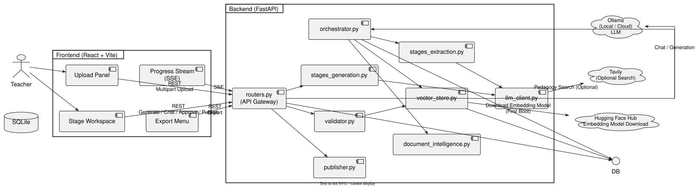

🖼️ **Deployed on Render** — live service logs showing the app booting, binding to its
port, and serving real `/api/documents/...` traffic:
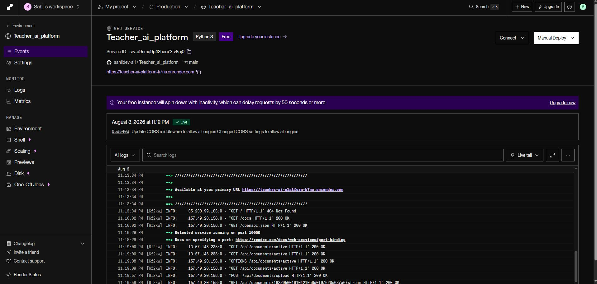

---

## The complete user flow

This is the exact path a request takes, screen by screen, naming the real
file/function that handles each step. Read this alongside the
[sequence diagram](#end-to-end-sequence-diagram) below.

### 1. Landing — is there already a document?
- **Frontend**: `App.jsx` mounts, calls `api.getActive()` → `GET /api/documents/active`.
- **Backend**: `routers.get_active_document()` checks `db.query(Document).first()`.
- If a document exists: `App.jsx` renders either `ProgressStream` (still on Stage 1-3)
  or `StageWorkspace` (Stage 4+). If not: renders `UploadPanel`.

🖼️ **The landing state** — no document active yet, the `UploadPanel` dropzone and the
optional clarifying-question fields:
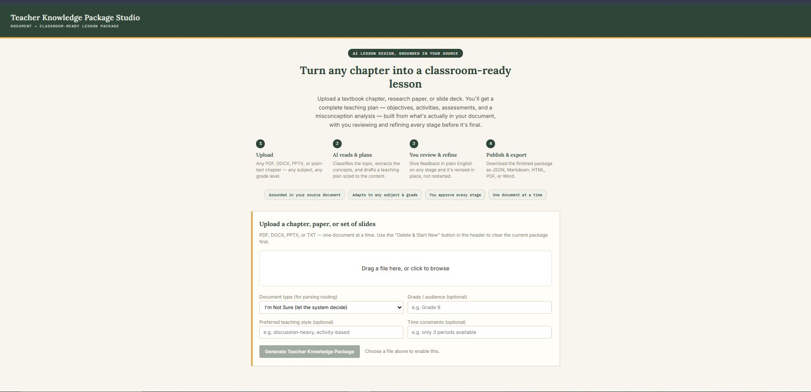

### 2. Upload
- **Frontend**: `UploadPanel.jsx` — drag-and-drop file input + doc-type-hint dropdown
  + 3 optional clarifying-question fields (grade, teaching style, time constraints).
  On submit, builds a `FormData` and calls `api.upload()`.
- **Backend**: `routers.upload_document()`:
  1. Rejects with `409` if `enforce_single_document` and a `Document` row already
     exists (the single-document lock).
  2. Saves the file to `UPLOAD_DIR`, creates a `Document` row (`db_models.Document`).
  3. Stashes the upfront teaching preferences into the `PipelineRun.message` field
     (as JSON) so Stage 4 can read them later without a second round trip.
  4. Queues `orchestrator.run_intelligence_pipeline()` as a `BackgroundTasks` job and
     immediately returns `{document_id, status: "processing"}`.

🖼️ **A file staged for upload** — `ncert-books-for-class-9-maths.pdf`, with the
document-type hint set to "Text with Equations" and grade set to "Grade 9":
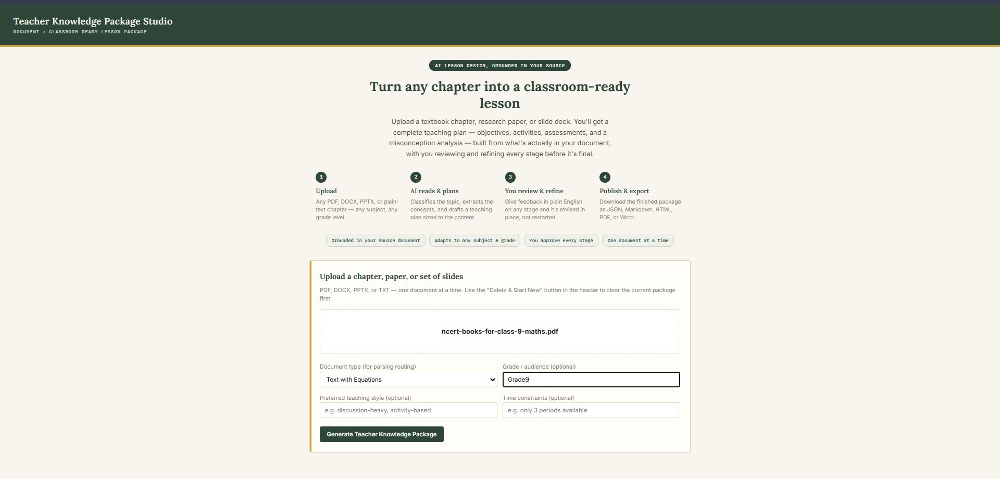

### 3. Stages 1-3 run automatically, progress streams live
- **Frontend**: `ProgressStream.jsx` opens an `EventSource` to
  `GET /api/documents/{id}/stream` (SSE) the moment a document ID exists.
- **Backend**: `routers.stream_progress()` polls the `PipelineRun` row every ~0.8s and
  pushes `{state, progress, current_stage, message}` whenever it changes.
- Meanwhile, in the background, `orchestrator.run_intelligence_pipeline()` runs:
  - `document_intelligence.parse_document()` → **Stage 1**
  - `stages_extraction.classify_document()` → **Stage 2**
  - `stages_extraction.extract_knowledge()` → **Stage 3** (map-reduce over chunks)
  - `vector_store.ingest_chunks()` — embeds the source chunks for later grounding checks
  - Sets `Document.status = "ready_for_planning"` and `PipelineRun.state = "waiting_user"`
- The moment the frontend sees `waiting_user`, it closes the SSE connection and
  switches to `StageWorkspace`.

🖼️ **`ProgressStream.jsx` live** — Stage 1 (Document Intelligence) parsing the upload:
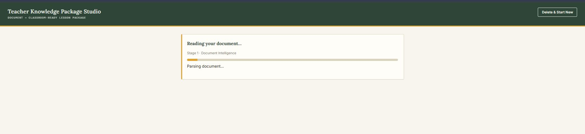

🖼️ Stage 3 (Knowledge Extraction) mid-run, map-reduce batching over the source chunks:
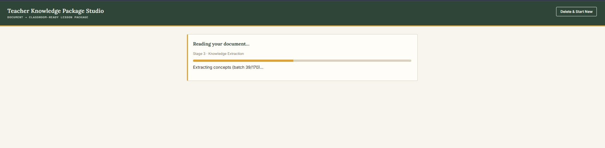

### 4. Stages 4-8 — the interactive loop
- **Frontend**: `StageWorkspace.jsx` fetches `GET /api/documents/{id}` on mount (full
  document + classification + knowledge base + every `StageOutput` so far), works out
  the first stage that isn't `approved` yet, and renders the **stage stepper**.
- For the current stage:
  - No content yet → shows a **Generate** button →
    `POST /stages/{stage}/generate` → `routers._run_stage_generation()` → the matching
    function in `stages_generation.py` → `llm_client.chat_structured()` (validates the
    model's JSON against the exact Pydantic schema, with repair retries) → saves a
    `StageOutput` row (`status="generated"`).
  - Content exists → renders it via `StageContentView` (full MCQs, teacher scripts,
    activities, etc. — this is what got fixed to show full detail instead of just
    counts), plus a **chat box**.
  - Teacher types feedback → `POST /chat/{stage}` → `routers.send_chat()` logs the
    message, then calls the *same* stage-generation function with `feedback=message`
    and `existing=<previous draft>` so it **revises**, not restarts.
  - Teacher clicks **Approve** → `POST /stages/{stage}/approve` → `StageOutput.status =
    "approved"` → `orchestrator.next_stage_after()` tells the frontend which stage
    unlocks next.
- `orchestrator.is_stage_unlocked()` is checked on **every** generate/chat call
  server-side too — the frontend's stepper isn't the only thing enforcing the gate.

🖼️ **Stage 4 — Teaching Plan, before generation.** The stage stepper (`4 · Teaching
Plan` through `8 · Learning Gaps`) with the **Generate** button:
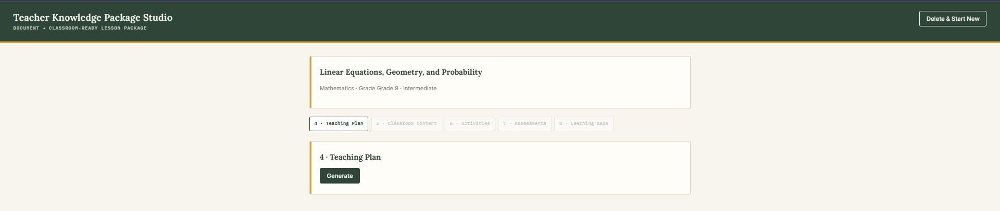

🖼️ Stage 4's generated output — a full, period-by-period teaching plan with rationale,
durations, and objectives per period:
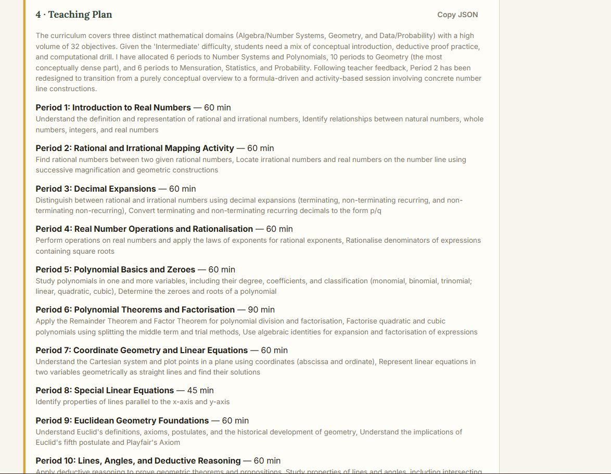

🖼️ The chat feedback loop in action — the teacher asked to *"make period 2 more formula
and activity based"*, the model revised the plan in place, and **Approve & Continue**
unlocks the next stage:
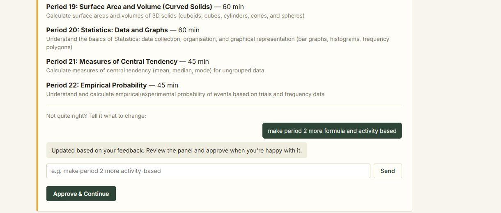

🖼️ Stage 5 — Classroom Content generating (`StageContentView` shows a **Generating...**
state while `stages_generation.py` calls the LLM):
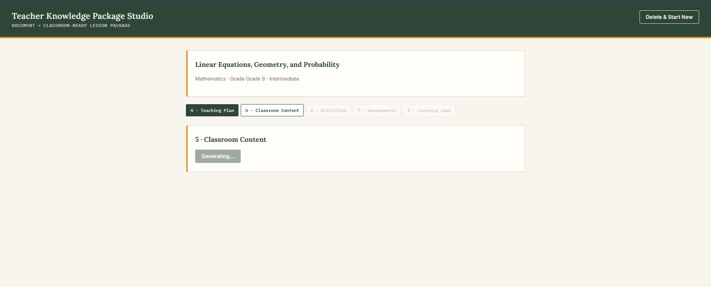

🖼️ Stage 5's generated output — a full per-period breakdown (entry ticket, teacher
script, blackboard notes, classroom activity, checkpoint questions, exit ticket):
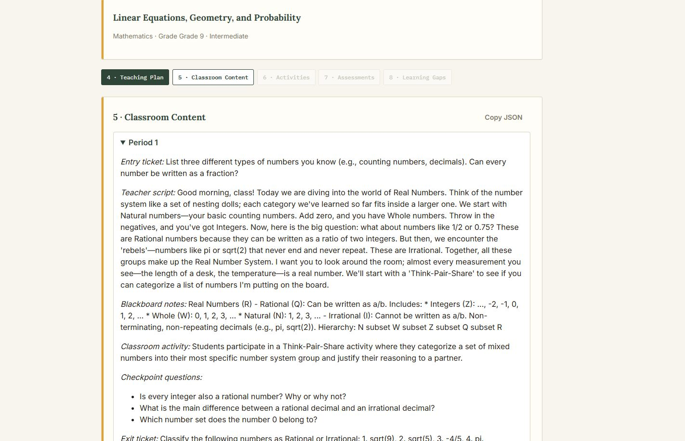

🖼️ Stage 7 — Assessments, one collapsible panel per period (`4 MCQs, 3 written
questions` each, expand any panel to see the full MCQ with the correct answer
highlighted):
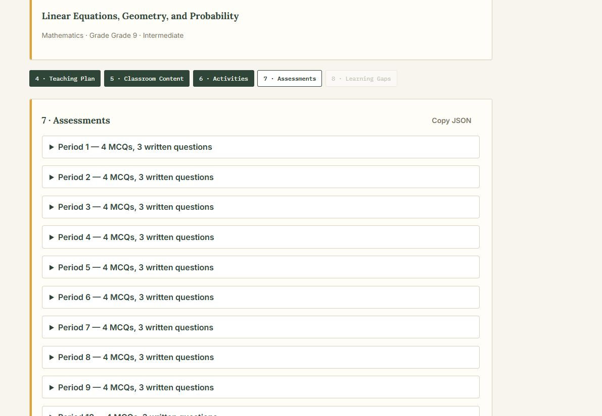

### 5. Publish (Stages 9-10)
- Once all 5 interactive stages are `approved`, `StageWorkspace.jsx` shows **Run
  Validation & Publish** → `POST /documents/{id}/publish`.
- **Backend**: `routers.publish()`:
  1. Re-validates every stage is actually approved.
  2. Calls `validator.validate_package()` → **Stage 9** (schema, hallucination-via-
     embedding-similarity, completeness, cross-stage consistency).
  3. Calls `publisher.build_package()` → **Stage 10** — assembles the final
     `TeacherKnowledgePackage` and writes `TeacherKnowledgePackage.json` to
     `EXPORT_DIR/{document_id}/`.
  4. Returns the full package (including the validation report) to the frontend.
- **Frontend** shows the validation summary (passed/failed, hallucination score) and
  renders `ExportMenu.jsx`.

🖼️ Stage 8 (Learning Gaps) approved, followed by the **Publish Teacher Knowledge
Package** panel — validation `PASSED`, hallucination risk score `0.379`, and all five
export/download buttons (JSON, Markdown, HTML, PDF, Word):
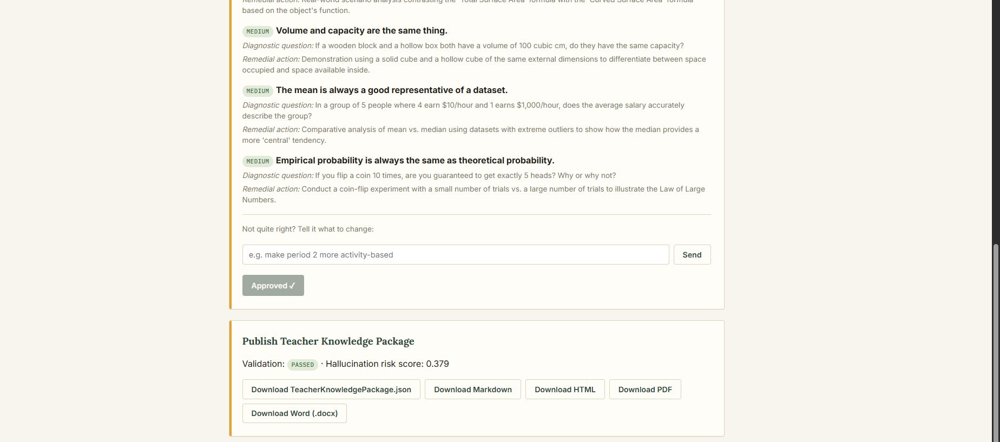

### 6. Export
- **Frontend**: `ExportMenu.jsx` is just 5 `<a>` links to
  `GET /api/documents/{id}/export?format=...`.
- **Backend**: `routers.export_package()` reads the saved `TeacherKnowledgePackage.json`,
  and for anything other than `format=json` calls `publisher.render_markdown()` then
  chains into `render_html()` / `render_pdf()` / `render_docx()` as needed.

### 7. Delete & start new
- **Frontend**: the header's **Delete & Start New** button (visible whenever a document
  is active) → confirms → `DELETE /api/documents/{id}`.
- **Backend**: `routers.delete_document()` removes the uploaded file, the export
  folder, every `EmbeddingChunk`/`ChatMessage`/`StageOutput`/`PipelineRun` row, and the
  `Document` row itself — after which a new upload is allowed again (the single-
  document lock resets).

---

## The 10-stage pipeline, as a flowchart


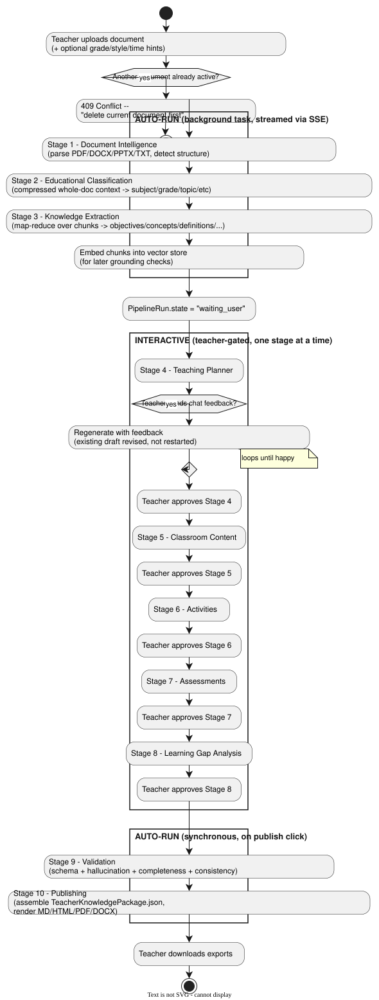

---

## State machines


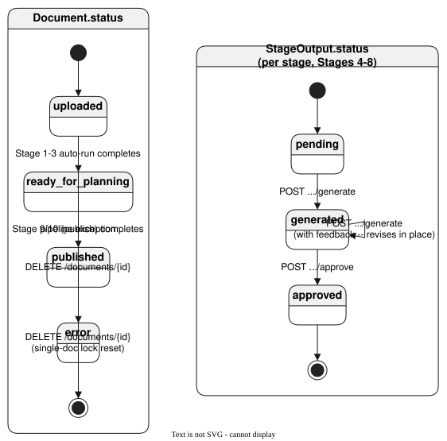

Why this matters: `orchestrator.is_stage_unlocked()` is purely a function of these two
state machines — Stage 4 unlocks once `Document.status` reaches `ready_for_planning`;
every stage after that unlocks only once the **previous** stage's `StageOutput.status`
is `approved`. There's no separate "workflow engine" — the state machine *is* the gate.

---

## End-to-end sequence diagram

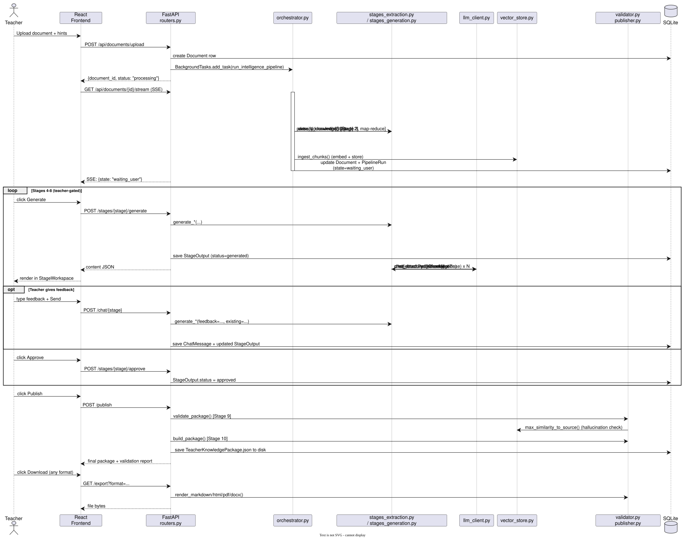

---

## Backend file-by-file reference

All paths are under `backend/app/`.

| File | What it does | Talks to |
|---|---|---|
| `__init__.py` | Empty — makes `app` a Python package. | — |
| `config.py` | `Settings` (pydantic-settings) — every env-driven tunable (Ollama host/model, chunk size, embedding model, single-doc-lock flag, Tavily/HF keys). Exposes a module-level `settings` singleton everything else imports. | Read by nearly every other file. |
| `database.py` | SQLAlchemy engine + `SessionLocal` + `Base`. `get_db()` is the FastAPI dependency every route uses; `init_db()` creates tables at startup. | `config.py` |
| `db_models.py` | ORM tables: `Document`, `StageOutput`, `ChatMessage`, `EmbeddingChunk`, `PipelineRun`. This *is* the state machine described above. | `database.py` |
| `schemas.py` | Every Pydantic contract: `Classification`, `KnowledgeBase` (+`Concept`, `Misconception`), `TeachingPlan` (+`PeriodPlan`), `PeriodContent`, `Activity`, `Assessment` (+`MCQ`, `WrittenQuestion`), `LearningGap` (+`LearningGapsResponse`), `ValidationReport` (+`ValidationIssue`), and the top-level `TeacherKnowledgePackage`. These are used for (a) prompting the LLM what shape to return, (b) validating what it actually returned, and (c) the API response shape. | Imported everywhere generation/validation happens. |
| `document_intelligence.py` | **Stage 1.** `parse_pdf/docx/pptx/txt()` each return a `ParsedDocument` (full text + detected headings/tables/figures + chunked text). `infer_file_type()` maps a filename to a parser. `parse_document()` is the single entry point `orchestrator.py` calls. | `config.py` (chunk size/overlap) |
| `llm_client.py` | The only file that talks to Ollama. `chat()` — retry-with-backoff raw call. `chat_json()` — JSON-mode + code-fence stripping + one repair-on-parse-failure retry. `chat_structured()` — validates the JSON against a given Pydantic schema, and on a validation error, sends the model *its own errors* and retries (up to 2x) before raising `LLMError`. `pedagogy_search()` — optional Tavily call, returns `[]` silently if `TAVILY_API_KEY` isn't set. | `config.py` |
| `vector_store.py` | The lightweight, no-separate-database RAG layer. `embed_texts()` — fastembed (ONNX, no torch). `ingest_chunks()` — embeds + stores a document's chunks as float32 blobs in `EmbeddingChunk` rows. `retrieve()` — top-k cosine similarity search. `max_similarity_to_source()` — used by Stage 9's hallucination check. | `config.py`, `db_models.py` |
| `stages_extraction.py` | **Stages 2-3.** `classify_document()` builds a *compressed whole-document* context (headings + head/tail + sampled middle chunks) and calls `chat_structured(..., Classification)` — deliberately NOT a retrieval query, since "what is this document?" is a global question. `extract_knowledge()` is map-reduce: `_map_extract()` mines each chunk-batch with the fast model, `_reduce_extract()` merges/dedupes everything with the main model. | `document_intelligence.py`, `llm_client.py`, `schemas.py`, `config.py` |
| `stages_generation.py` | **Stages 4-8.** One `generate_*()` function per stage, each accepting an optional `feedback` + `existing` pair so chat-driven revision works. Calls `pedagogy_search()` for Stages 4-6 only, always labeled as secondary/non-factual in the prompt. | `llm_client.py`, `schemas.py`, `config.py` |
| `validator.py` | **Stage 9.** `validate_package()` runs four checks and returns one `ValidationReport`: `_check_schema` (re-validated construction), `_check_consistency` (period numbering matches across all stages), `_check_completeness` (every planned concept traces to the knowledge base), `_check_hallucination` (embedding similarity of factual content against the source — mentor moments/activities are deliberately excluded). | `schemas.py`, `vector_store.py`, `config.py` |
| `publisher.py` | **Stage 10.** `build_package()` assembles the final `TeacherKnowledgePackage`. `render_markdown()` is the single source of truth for the human-readable "Teacher Guide" — `render_html()`, `render_pdf()` (xhtml2pdf), and `render_docx()` (a minimal Markdown→python-docx walker) all build on top of it. | `schemas.py` |
| `orchestrator.py` | Glue between Stage 1-3 (auto) and Stage 4-8 (gated). `run_intelligence_pipeline()` is the `BackgroundTasks` target — runs Stages 1-3 end to end, updating the `PipelineRun` row as it goes (this is what `ProgressStream.jsx` polls via SSE). `STAGE_ORDER`, `next_stage_after()`, `is_stage_unlocked()` implement the sequential-approval gate. | `db_models.py`, `document_intelligence.py`, `stages_extraction.py`, `vector_store.py` |
| `routers.py` | The API Gateway — every HTTP route. Wires the single-document lock, the SSE stream, stage generate/chat/approve, publish, and export. This is the file that *calls* almost everything else. | Everything above |
| `main.py` | FastAPI app instance, CORS middleware, `@app.on_event("startup")` → `init_db()`. | `config.py`, `database.py`, `routers.py` |
| `test_pipeline_e2e.py` | Full pipeline test against the real FastAPI app with a **mocked** LLM + mocked embeddings (no real Ollama/HF network needed). Proves the whole state machine + schema-repair retry logic end to end. | Everything (via `app.main`) |
| `manual_api_test.sh` | Same walkthrough as the test above, but against a **running server with a real Ollama key** — a bash/curl script, not a mock. | — (calls the live HTTP API) |

---

## Backend module dependency diagram


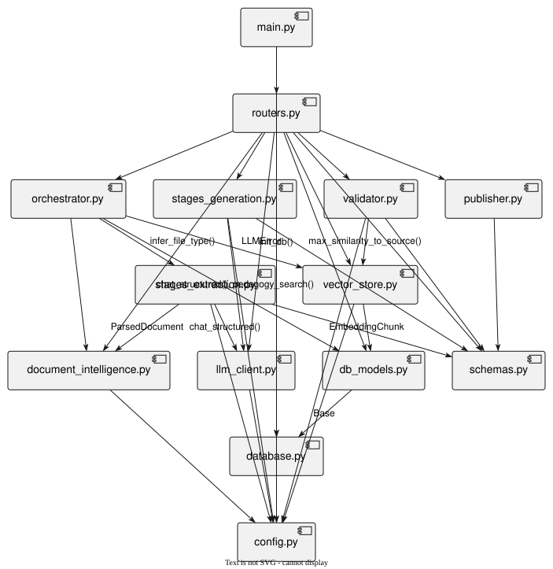

Reading this diagram: `config.py` and `database.py`/`db_models.py`/`schemas.py` are the
foundation everything else builds on (no business logic, just settings/models/contracts).
`llm_client.py` and `vector_store.py` are the two "infrastructure" services (LLM calls,
embeddings) that the stage files consume. `routers.py` is the only file that talks to
the frontend, and the only file that calls almost every other module — it's intentionally
a thin coordination layer, not where any actual AI logic lives.

---

## Frontend file-by-file reference

All paths are under `frontend/src/`.

| File | What it does | Talks to |
|---|---|---|
| `main.jsx` | React entry point — mounts `<App />` into `#root`. | `App.jsx` |
| `App.jsx` | Top-level state: checks for an active document on load (`api.getActive()`), and switches between three views: `UploadPanel` (no active doc) → `ProgressStream` (Stage 1-3 running) → `StageWorkspace` (Stage 4+). Also renders the header's **Delete & Start New** button. | `api.js`, all three components below |
| `api.js` | The single fetch wrapper — every backend call goes through here (`upload`, `getDocument`, `generateStage`, `sendChat`, `approveStage`, `publish`, `exportUrl`, `streamUrl`, `deleteDocument`). Reads the backend base URL from `VITE_API_BASE` (set in `.env`). | Backend REST/SSE API |
| `index.css` | Design tokens (the "blackboard + index card" palette/typography) and all component styling — no CSS-in-JS, no Tailwind, just custom properties + plain classes. | — |
| `components/UploadPanel.jsx` | Drag-and-drop dropzone + doc-type-hint dropdown + the 3 optional clarifying-question fields (grade, teaching style, time constraints). Builds a `FormData` and calls `api.upload()`. | `api.js` |
| `components/ProgressStream.jsx` | Opens an `EventSource` to the SSE endpoint, renders a live progress bar + current-stage label, and calls `onReady()` the moment the backend reports `waiting_user`. | `api.js` |
| `components/StageWorkspace.jsx` | The largest component — the stage stepper, `StageContentView` (renders each stage's content in full: teaching plan, classroom content, activities, assessments with highlighted correct answers, learning gaps), the chat panel, the approve gate, and the "Publish" trigger once all 5 stages are approved. | `api.js`, `ExportMenu.jsx` |
| `components/ExportMenu.jsx` | 5 download links (json/md/html/pdf/docx), each just an `<a href={api.exportUrl(...)}>`. | `api.js` |

---

## Data model reference

The full chain of Pydantic schemas (`schemas.py`) that data flows through, stage by stage:

```
Classification            (Stage 2)  --\
KnowledgeBase              (Stage 3)  ---> feed into every later stage as grounding context
  ├─ Concept[]
  ├─ Misconception[]
TeachingPlan                (Stage 4)
  └─ PeriodPlan[]           -----------> period_number is the join key used everywhere below
PeriodContent[]             (Stage 5, one per period)
Activity[]                  (Stage 6, one per period)
Assessment[]                (Stage 7, one per period)
  ├─ MCQ[]
  └─ WrittenQuestion[]
LearningGap[]                (Stage 8)
ValidationReport             (Stage 9)
  └─ ValidationIssue[]
TeacherKnowledgePackage       (Stage 10) -- the sum of everything above, plus document_id
```

`period_number` is the thread that ties Stages 4-7 together — `validator._check_consistency()`
exists specifically to catch a mismatch (e.g. Stage 6 generating an activity for a period
that doesn't exist in Stage 4's plan).

---

## API reference

All routes are prefixed `/api` (see `routers.py`).

| Method & Path | Purpose |
|---|---|
| `GET /documents/active` | Is there a document loaded on this instance right now? |
| `POST /documents/upload` | Upload a file (+ optional hints). `409` if one is already active. |
| `DELETE /documents/{id}` | Wipe everything for this document (file, embeddings, stages, chat, exports). |
| `GET /documents/{id}/stream` | SSE progress stream for the Stage 1-3 auto-run. |
| `GET /documents/{id}` | Full document detail: classification, knowledge base, every stage's status/content. |
| `POST /documents/{id}/stages/{stage}/generate` | Generate (or regenerate, with `{"feedback": "..."}`) a stage. |
| `POST /documents/{id}/stages/{stage}/approve` | Approve a stage, unlocking the next one. |
| `GET /documents/{id}/chat/{stage}` | Chat history for a stage. |
| `POST /documents/{id}/chat/{stage}` | Send feedback — logs it AND triggers a regeneration. |
| `POST /documents/{id}/publish` | Run Stage 9 validation + Stage 10 packaging. |
| `GET /documents/{id}/export?format=json\|md\|html\|pdf\|docx` | Download the final package in a given format. |

---

## Setup & running locally

```bash
# Backend
cd backend
python3 -m venv venv && source venv/bin/activate
pip install -r requirements.txt
cp .env.example .env        # set OLLAMA_API_KEY
uvicorn app.main:app --reload --port 8000

# Frontend (second terminal)
cd frontend
npm install
npm run dev                 # reads VITE_API_BASE from frontend/.env
```

## Testing

```bash
# Mocked end-to-end test (no real API calls, ~seconds to run)
cd backend
PYTHONPATH=. python3 test_pipeline_e2e.py

# Real-server curl walkthrough (needs the server running + a real Ollama key)
cd backend
./manual_api_test.sh /path/to/chapter.pdf
```

## Deploying to Render

See `backend/render.yaml` for the blueprint. Key points: `--workers 1` (a second worker
would double-load the embedding model and can blow the free-tier RAM budget), and the
free tier's disk is ephemeral, so `SQLITE_PATH`/`UPLOAD_DIR`/`EXPORT_DIR` reset on
redeploy unless you attach a persistent disk.

## Known limitations / next steps

- SQLite + local disk is single-instance by nature — horizontal scaling would need
  Postgres + object storage (S3) for uploads/exports.
- DOCX/PDF export is a minimal Markdown walker, not a full CSS-to-DOCX engine — fine for
  lesson-plan text, would need more work for complex tables/equations.
- No OCR pass yet for scanned PDFs — `ParsedDocument.needs_advanced_parsing` is a ready
  hook for one.
- No auth/multi-tenancy — this is deliberate (single-document-at-a-time, resource-capped
  free-tier deploy), but would need to change for a multi-teacher production deployment.
